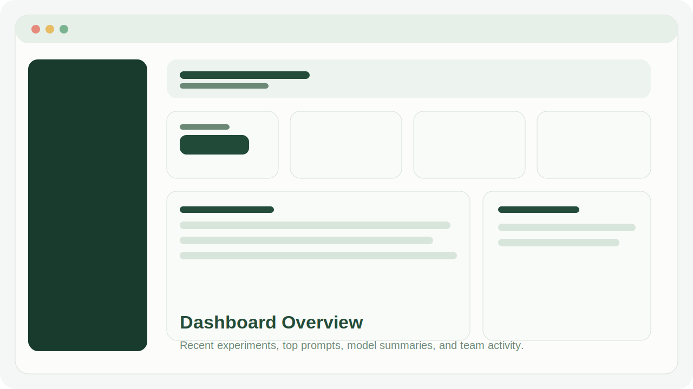
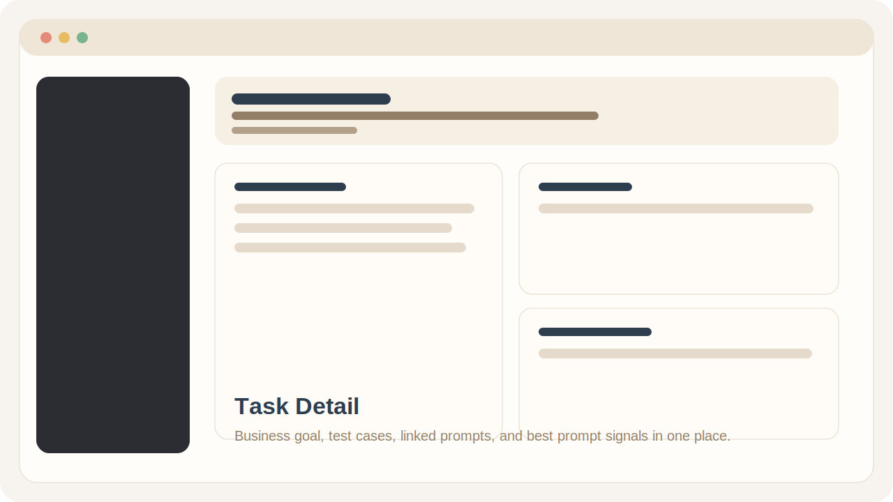
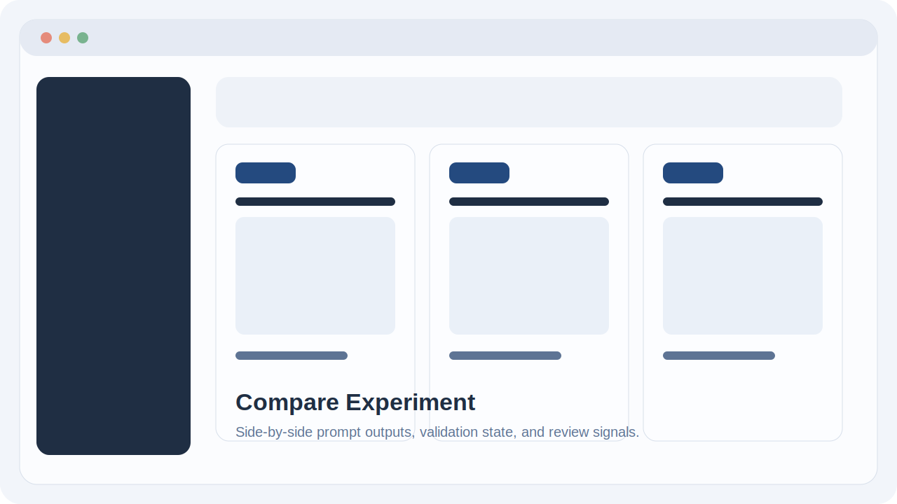
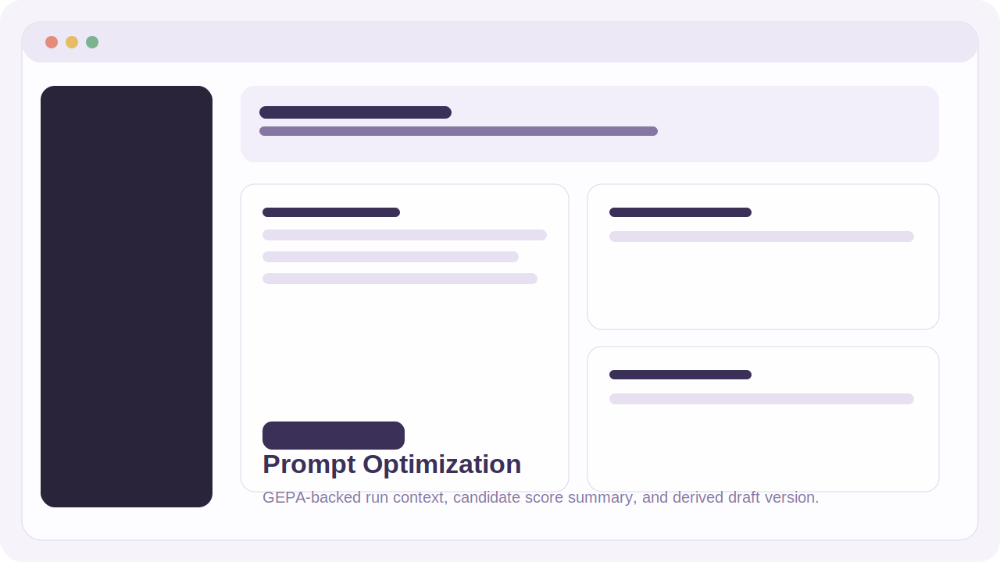

# PromptLab

PromptLab is an internal AI experimentation workspace for teams that need more than a chat box.

It organizes prompt work around a simple product flow:

**Tasks -> Prompts -> Experiments -> Library**

Instead of keeping prompts in chats, docs, or random notes, PromptLab gives teams one place to:

- define business-facing AI tasks
- version prompt drafts over time
- run quick tests, compare runs, and batch experiments
- validate structured outputs
- review quality manually and automatically
- promote strong prompt versions into a reusable internal library
- manage workspace-level model connections, permissions, and audit visibility

The result is a portfolio project that behaves much closer to a real internal product than a typical AI demo.

## Real Usage Scenarios

PromptLab is easiest to understand through concrete internal workflows:

### 1. Support ticket triage

An operations team defines a task for incoming support tickets, stores representative examples as test cases, iterates on classification prompts, and compares prompt versions before promoting the most reliable one into the shared library.

### 2. Customer email summarization

A service team creates a prompt workflow that turns long customer threads into short internal summaries, tests tone and structure on real examples, and keeps an experiment trail that shows which prompt version actually improved clarity.

### 3. Business-tone rewriting

A communications or back-office team drafts prompts that rewrite rough internal text into a more consistent business tone, reviews outputs manually, and keeps approved versions reusable across the workspace instead of rewriting the same prompt from scratch.

## Screenshots

The repository currently ships with lightweight preview mockups in [`docs/screenshots`](./docs/screenshots). Replace them with real UI captures when you publish the final public version.

| Dashboard | Task Detail |
|---|---|
|  |  |

| Experiment Compare | Prompt Optimization |
|---|---|
|  |  |

## Overview

PromptLab is built around the idea that AI work inside a company should be:

- structured instead of ad hoc
- testable instead of intuitive-only
- visible instead of hidden in chat history
- reusable instead of repeatedly reinvented

In the UI, business workflows are called **Tasks**. In the backend model, they are stored as `UseCase`.

Each task can have:

- test cases with expected output
- prompt templates
- multiple prompt versions
- experiment history
- evaluations
- best-performing prompt signals

## What It Does

### Prompt workflow

- Create prompt templates with an initial version in one request
- Maintain revision history with change summaries and model preferences
- Run quick draft tests without creating a full experiment
- Promote approved prompt versions into a shared prompt library

### Experiment workflow

- `single` experiments for one prompt on one input
- `compare` experiments for multiple prompt versions on the same input
- `batch` experiments across saved test cases
- queued execution with progress tracking and retry classification
- realtime experiment updates via Laravel Reverb

### Evaluation workflow

- manual review with clarity, correctness, completeness, tone, and hallucination risk
- structured JSON output validation
- automatic checks against expected text fragments and JSON subsets
- analytics summaries for prompts, models, and use cases

### Team workflow

- multi-workspace structure
- team switching and role-based access
- workspace-scoped AI connection management
- audit visibility for important actions

### Optimization workflow

- start a prompt optimization run from a saved prompt version
- reuse eligible test cases as train/validation examples
- run a GEPA-backed optimization job
- create a derived prompt draft from the best candidate

## Why This Project Exists

Most prompt work inside teams breaks down quickly:

- prompts live in chat history
- nobody remembers which version actually worked
- experiments are repeated manually
- outputs are hard to compare
- business stakeholders cannot see what improved and why

PromptLab turns that into a proper internal workflow. It is meant to feel like the kind of AI tool a digital unit or product team could actually use for experimentation, demos, and internal learning.

## Main Product Flows

### 1. Task-first workflow

Start from a business task, not a model picker. The task defines the context, goal, and test data before prompt iteration begins.

### 2. Prompt versioning

Prompt templates behave like prompt families. Each family can evolve through multiple versions with explicit metadata, notes, and a preferred model.

### 3. Controlled experimentation

Instead of guessing whether a prompt is better, users can run structured experiments and compare outputs directly.

### 4. Evaluation and approval

Good prompt versions are not just "saved". They are reviewed, scored, and then moved into a safer reuse layer through the library.

### 5. Optimization from data

Prompt optimization is treated as another workflow step, not magic. It starts from a real prompt version and real test cases, then produces a derived draft that can still be reviewed by a human.

## Demo Use Cases

The seeded examples are intentionally business-facing:

- Customer Email Summarization
- Ticket Categorization
- Rewrite for Business Tone
- Meeting Note Summarization

These scenarios make the system easier to demo to both technical and non-technical audiences.

## Tech Stack

### Backend

- PHP 8.2+
- Laravel 12
- MariaDB / MySQL
- Laravel Reverb
- queued jobs for experiment processing

### Frontend

- Vue 3
- Inertia.js
- Vite
- Tailwind CSS
- Blade app shell

### AI runtime

- mock provider for local development
- OpenAI-compatible provider integration
- Python-backed GEPA runtime for prompt optimization

## Architecture

The backend is split into clear layers instead of pushing all logic into controllers or models.

| Layer | Responsibility |
|---|---|
| Controllers | request/response coordination |
| Form Requests | validation and access-aware request rules |
| Resources | stable payload shaping for UI and API |
| Services | business workflows, analytics, provider orchestration, optimization |
| Jobs | async execution and failure handling |
| Provider contracts | model integration boundaries |

Important services:

- `app/Services/ExperimentService.php`
- `app/Services/AnalyticsService.php`
- `app/Services/PromptCompiler.php`
- `app/Services/StructuredOutputValidator.php`
- `app/Services/LLMProviderManager.php`
- `app/Services/PromptOptimizationService.php`
- `app/Services/GepaPromptOptimizer.php`

## Repository Notes

- Repository folder name: `PromptFactory`
- Product name in the app: `PromptLab`
- Additional planning notes: [`PLAN.md`](./PLAN.md)
- UX flow reference: [`docs/user-life-cycle-map.md`](./docs/user-life-cycle-map.md)

## Local Setup

### Prerequisites

- PHP 8.2+
- Composer
- Node.js + npm
- MySQL / MariaDB
- optional XAMPP workflow for local hosting

### Install

```bash
composer install
npm install
cp .env.example .env
php artisan key:generate
php artisan migrate --seed
npm run build
```

### Development

Standard local loop:

```bash
composer run dev
```

Realtime experiment updates:

```bash
php artisan reverb:start
```

## Demo Accounts

- `admin@promptlab.local` / `password`
- `team@promptlab.local` / `password`

## Verification

Verified locally with:

```bash
php artisan test
npm run build
```

## Roadmap

Possible next steps:

- richer automatic evaluation heuristics
- prompt diffs between versions
- CSV dataset import
- comments around experiments and approvals
- additional provider integrations
- exportable experiment history
- stronger approval policies

## License

This project is shared as a portfolio and internal-tool showcase built on top of the Laravel ecosystem.
