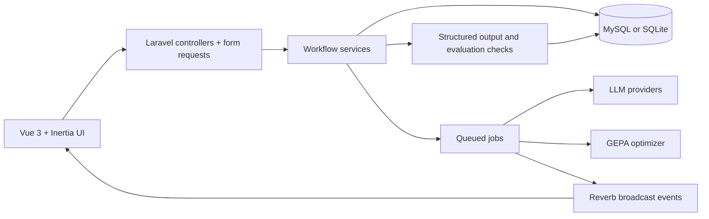

# Architecture

Evala is designed as an internal AI workspace, not a single-purpose prompt playground. The architecture keeps business workflows visible while isolating the risky and expensive parts of AI execution behind explicit boundaries.

## System Overview

## Main Layers

| Layer | Responsibility |
|---|---|
| Vue + Inertia pages | Workspace UI, prompt editing, experiment monitoring |
| Controllers | Entry points for task, prompt, experiment, library, and admin workflows |
| Form Requests | Authorization-aware validation and request shaping |
| Services | Business workflows, analytics, prompt compilation, provider orchestration |
| Jobs | Long-running experiment and optimization execution with retry rules |
| Provider boundary | OpenAI-compatible and Anthropic-compatible execution behind one contract |
| Reverb events | Realtime progress updates without forcing full page reloads |

## Engineering Decisions

### 1. Queue experiments instead of running them inside the request

Experiment creation writes the experiment and its runs first, then dispatches jobs after the database transaction commits.

Why:

- avoids long request timeouts for compare and batch runs
- keeps experiment creation idempotent and observable
- makes progress tracking and failure handling explicit

### 2. Use workspace-scoped model whitelisting

Users can only submit models that are allowed for their workspace and team-scoped provider connection.

Why:

- prevents arbitrary model strings from reaching the runtime
- avoids accidental cost spikes from unsupported providers
- keeps workspace AI access policy enforceable on the server

### 3. Treat broadcast authorization as a security boundary

Realtime experiment channels are authorized against the experiment's owning workspace, not just the logged-in session.

Why:

- protects multi-tenant experiment data from cross-workspace leakage
- keeps Reverb aligned with the same team isolation rules as HTTP requests

### 4. Separate permanent failures from transient provider failures

Queued experiment jobs classify provider and network errors before deciding whether to retry.

Why:

- retries help with 429s, timeouts, and temporary upstream failures
- validation and business-rule failures stop immediately instead of burning more queue time
- failure semantics stay understandable in operations and testing

### 5. Keep evaluation first-class instead of relying on intuition

Evala stores manual review scores, automatic checks, JSON validation, and experiment summaries alongside prompt versions.

Why:

- prompt quality becomes reviewable rather than anecdotal
- improvements can be explained in demos and stakeholder discussions
- approved prompt versions have evidence behind them

### 6. Isolate provider integrations behind a manager and contracts

Application code does not talk directly to vendor SDKs from controllers or pages.

Why:

- makes it easier to swap between mock, OpenAI-compatible, and Anthropic-compatible flows
- keeps prompt workflows stable even when provider details change
- limits the blast radius of provider-specific security and reliability rules

### 7. Keep optimization as a supervised workflow step

Prompt optimization runs generate candidate drafts, but the resulting prompt still goes back through the same versioned review flow.

Why:

- optimization does not bypass human review
- generated drafts remain traceable and comparable
- the system stays useful for real internal teams, not just benchmark demos

## What This Shows in a Portfolio Context

This architecture demonstrates more than API usage:

- full-stack product thinking across UI, backend, and runtime execution
- applied AI workflows with evaluation and governance
- operational concerns such as queue safety, authorization, and reproducibility
- pragmatic boundaries that make the system maintainable as it grows
